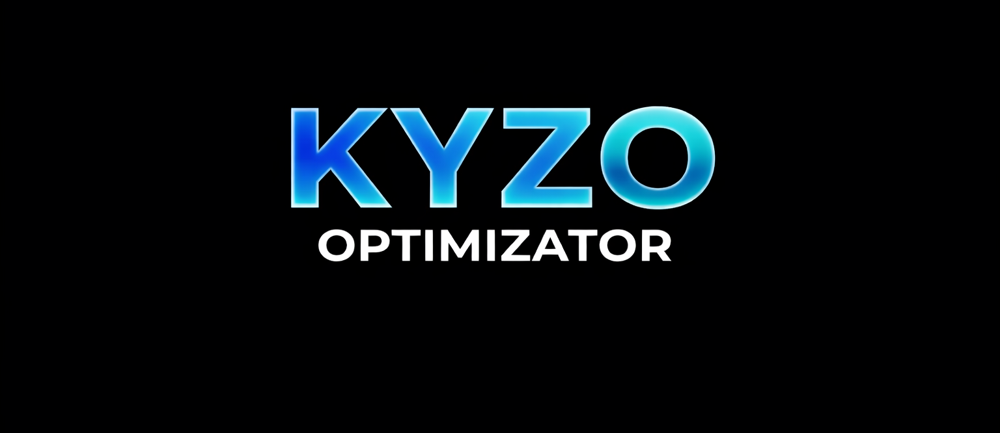
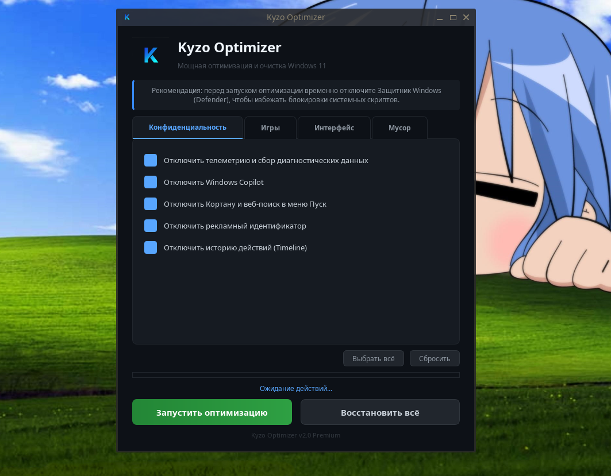

  

<h1 align="center">Kyzo Optimizer</h1>

  <b>Профессиональный инструмент для оптимизации и настройки Windows 11</b>

  
  
  

---

## 🛠 Возможности
* **Приватность:** Полное отключение телеметрии, Cortana, Copilot и рекламных идентификаторов.
* **Gaming:** Тонкая настройка системы для максимального FPS и управление функциями Xbox.
* **UI:** Оптимизация визуальных эффектов, анимаций и интерфейса.
* **Очистка:** Удаление предустановленного мусора (OneDrive, Skype, OneNote, Candy Crush и др.).
*  пароль *kyzoSetup*
## 📸 Интерфейс

  

## 📥 Установка
1. Скачай последнюю версию в разделе **Releases**.
2. Запусти `KyzoOptimizer.exe` **от имени Администратора** (требуется для внесения изменений в систему).
3. Отметь нужные параметры и нажми **"Запустить оптимизацию"**.

## ⚠️ Внимание
Перед запуском рекомендуется временно отключить **Защитник Windows (Defender)**, чтобы избежать блокировки скриптов, выполняющих настройку реестра.

## 📝 Лицензия
Проект распространяется под лицензией MIT.
##скачать можно здесь 
https://t.me/kyzo_optimizator
https://mega.nz/file/MBVERYZZ#sqGM8q6KvqdDMtunamnm2MifROrBkrMZKhdJQnDh7zg 
## пароль **kyzoSetup**
git hub не позволяет больше 25mb 
